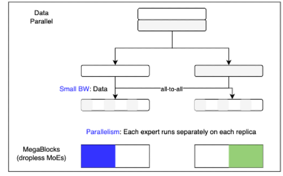

# FSDP2 with Megablocks

This repo demonstrates FSDP2 sharding using Databricks Megablocks, inspired by the blog https://pytorch.org/blog/training-moes/.
- explore FSDP2-style sharding with native `torch.DeviceMesh`.
- compare differences between FSDP1 and FSDP2.

We have two scripts:
- [train_accelerate_fsdp2.py](./train_accelerate_fsdp2.py): Huggingface (HF) trainer has not yet integrated FSDP2, so this is a custom train loop implementation using HF Accelerate to handle things like gradient accumulation.
- [train_fsdp1.py](./train_fsdp1.py): Uses HF trainer with its current integration of FSDP1.

Note:
- These scripts are hardcoded to test the 47B MoE model `"mistralai/Mixtral-8x7B-Instruct-v0.1"`.
- Also hardcoded to use `alpaca` with instruction tuning, the dataset is [`data.json`](./data.json).
- Both scripts have an `use_megablocks_sharding`, when set to `True` activates expert parallel `megablocks`-type sharding.
- Currently this was tested on `torch==2.3.1` and the comments are meant for this verison, however the implementation of FSDP2 did not seem to change much in the latest 2.4 release [see here](https://github.com/pytorch/pytorch/blob/main/torch/distributed/fsdp/fully_sharded_data_parallel.py).

## What is Expert Parallel?



In the data parallel dimension, seperate shards (stylised as white and grey in the above pic) are split across two machines. But unlike FSDP which will cut up a single MoE, with the intention of then all-gathering them before a forward, expert parallel will preserve the expects intactly in seperate devices (as seen blue the blue and green colors). The idea is to then instead of all-gather on weights, use an all-to-all on data, such that all tokens belonging to the blue MoE is brought to the device in which it resides, and so on. 

The key assumption here is that within a single data example (or batch) **the tokens assigned to each expert is roughly the same**, so each device will run in parallel for approximately the same amount of time, then moving on to the next batch. 
- The challenge is to then manage slight differences in token numbers without dropping them; this is addressed by the `DroplessMoE` in megablocks using sparse matmuls.

### Performance

Expert parallel will be able to achieve increased throughputs if the number of tokens to each expert are well-balanced.


Emb, Attn | MoE | train_runtime (s) | train_steps_per_sec | gpu_mem_used_peak (MiB)
--|--|--|--|--
FSDP2 | FSDP2 | 12345 | 0.033 | 54163
FSDP2 | megablocks | 3478 | 0.117 | 46692


## Running

Install dependencies (will require CUDA_TOOLKIT to build megablocks):
```
pip install -r requirements.txt
```

Running FSPD2 script uses torchrun, as there seems to be some problems with the `accelerate` launcher and FSDP2. Instead use `torchrun`; the below example runs the FSDP2 with megablocks expert parallel on 8 GPUs.
```
torchrun --nproc_per_node=8 \
	--rdzv_backend c10d \
	--rdzv_endpoint="localhost:0" \
	--local-ranks-filter 0 --role rank \
	train_accelerate_fsdp2.py \
	--gradient_accumulation_steps 16 \
	--use_megablocks_sharding True \
	--debug True \
	--learning_rate 5e-5
```

Running FSDP1 script uses accelerate. The equivalent run to above would be 
- [`accelerate.yaml`](./accelerate.yaml) are the launcher defaults.
- [`accelerator_config`](./accelerator_config.json) are used to setup HF accelerate.
- the settings `data.json`, `torch_dtype`, etc are hardcoded in the FSDP2 script.
```
TRANSFORMERS_VERBOSITY=info \
accelerate launch \
    --main_process_port 29502 \
    --num_processes 8 \
    --config_file accelerate.yaml \
	train_fsdp1.py \
    --accelerator_config accelerator_config.json \
    --data_path data.json \
    --torch_dtype bfloat16 \
    --output_dir ./results \
    --num_train_epochs 1 \
    --per_device_train_batch_size 1 \
    --per_device_eval_batch_size 1 \
    --gradient_accumulation_steps 16 \
    --gradient_checkpointing True \
    --evaluation_strategy "no" \
    --save_strategy "no" \
    --learning_rate 5e-5 \
    --lr_scheduler_type "linear" \
    --logging_steps 1 \
	--use_megablocks_sharding True
```

## Implementation Discussion

The key point is to understand the similarities/differences beween the FSDP2 and FSDP1 implementations. 

Process Group / Device Mesh and MoE Sharding
- thanks to pytorch native `DeviceMesh` is is very convinient to handle 2D or 3D parallel. In our demo, we consider simplified scenarios, of having a only a data paralell (DP) group, or both a DP and expert parallel (EP) group. 
- `shard_moe` in [megablocks_utils/shard_moe_utils.py](./megablocks_utils/shard_moe_utils.py) does two things:
    1. call `init_device_mesh`. Here `ep_size` is the number of devices the experts are split across, and `dp_size = world_size // ep_size`. Hence if `ep_size == world_size`, then each device will have one expert, and in this case `dp_size=1`. 
    2. build the dropless MoE (`dMoE`) and assign the sharded weights via `assign_mlp_v2_weights`. Custom code has to be written to open up the checkpoints, and shard them across `ep_size` devices. The first is tedious, but the latter we leverage `distribute_tensor` over the `device_mesh`. The second is possible due to `dMoE`'s implementation which has all the experts weights concatenated together (like head dimensions in say `k_proj`). Unofortunately HF MoE's in general implement each expert as a seperate layer, and more custom code will be needed to leverage `distribute_tensor`, which is not ideal.
    3. The `router` is not distributed, and so its tensors will be regular and not `DTensors`.

FSDP Sharding:
- this needs to be handled seperately from the MoE sharding. In FSDP1 this is convinient thanks to `ignored_modules`; but this is missing in FSDP2. Thus, for FSDP2 some hackery is required for mimick this effect.
- when `dp_size == 1`, then one usually considers FSDP to operate in the `NO_SHARD` mode. However, this is very restrictive, and not necessary as we demonstrate here. 
    1. When `dp_size == 1`, we share process group with the expert parallel dim.
    1. To share, when performing FSDP preperation, we use `ignore_modules` so that the FSDP sharding does not intefere with the MoE sharding that has already been completed.
- having some trouble getting FSDP2 working in this setup with `CheckpointImpl.NO_REENTRANT`

